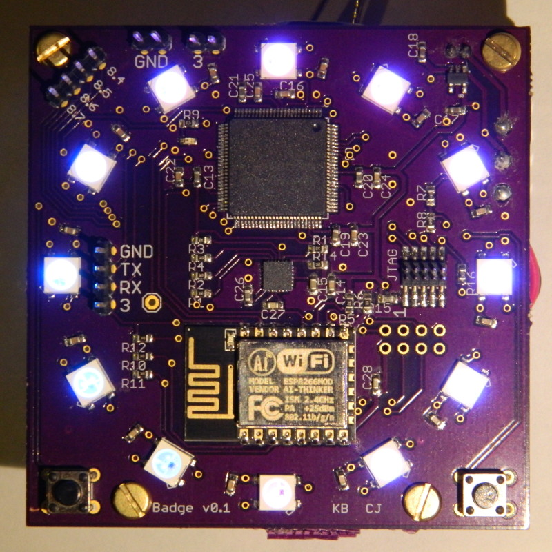

# Badge

This is a personal electronic badge, worn at Defcon 24. It is a collaboration between Kris Brosch and Chris James.

The primary microcontroller is a [TI MSP432](http://www.ti.com/lsds/ti/microcontrollers_16-bit_32-bit/MSP432/overview.page). The board also has a ring of WS2812b "neopixel" LEDs, an LSM9DS0 accelerometer/magnetometer/gyroscope, and an ESP8266 WiFi module. The project's goal was primarily to experiment with the MSP432 and other parts as well as to practice PCB design and home assembly.

The firmware currently has two [demo modes](badge/leddemos.c), toggled using the left button. 

The first mode demonstrates the LEDs and the WiFi. The LEDS show a spinning pattern of two colors. The ESP8266 can be turned on and off using the right pushbutton; while on, the ESP8266 acts as a WiFi AP, and a minimal [webserver](badge/http.c) serves a page on http://192.168.4.1/demo which can be used to change the colors/properties of the LED demo.

The second mode demonstrates the accelerometer; the LEDs are split into a yellow and blue "sunset" which changes with the board's orientation.

## Building the Firmware

We are building the firmware with arm-none-eabi-gcc on ArchLinux. The build.sh script simply runs make in the badge/build directory.

## Flashing and Debugging with OpenOCD and GDB

In order to use OpenOCD to flash the board, you'll need to obtain:
* The version of OpenOCD that supports the MSP432
* A physical JTAG interface and corresponding OpenOCD interface config file

To flash the board, we're using a [patched version of OpenOCD](http://openocd.zylin.com/#/c/2699/) that supports the MSP432; you'll have to build this yourself and leave the openocd binary (or a link to it) in the openocd directory. The scripts also expect your OpenOCD interface configuration (for your JTAG adapter) to be placed in openocd/interface.cfg. Once you have openocd and interface.cfg added to the openocd directory, you can run the flash.sh script to flash the firmware to the board. Then you can run startopenocd.sh in one terminal and debug.sh in another to launch arm-none-eabi-gdb in order to debug the firmware.

